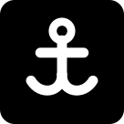
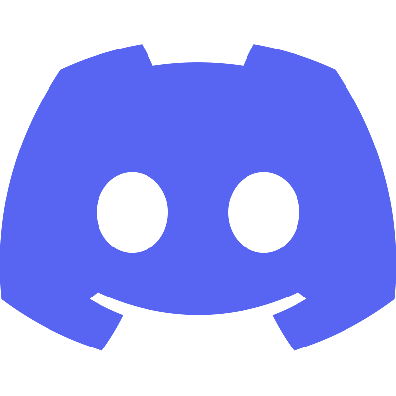
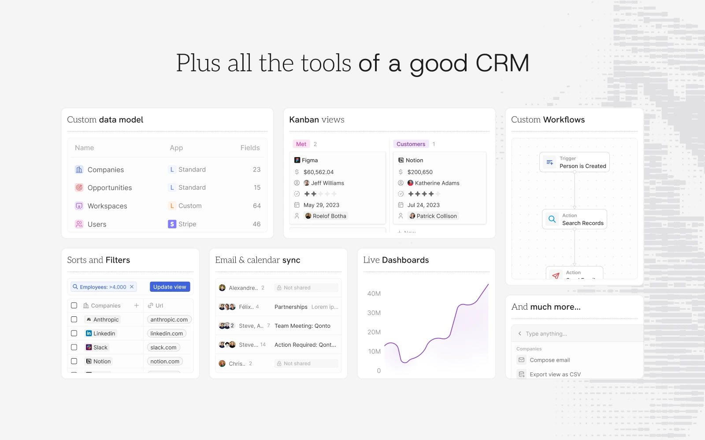
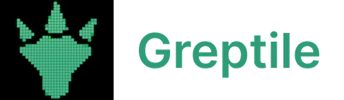

<p align="center">
  <a href="https://github.com/Vatsa10/Harbour">
    
  </a>
</p>

<h2 align="center">Harbour</h2>

<p align="center"><a href="https://github.com/Vatsa10/Harbour"> Repository</a> · <a href="https://docs.searm.com"> SeaRM Documentation</a> · <a href="https://discord.gg/cx5n4Jzs57"> Discord</a></p>

<p align="center">
  <a href="https://github.com/Vatsa10/Harbour">
    <picture>
      <source media="(prefers-color-scheme: dark)" srcset="./packages/searm-website/public/images/readme/github-cover-dark.webp" />
      <source media="(prefers-color-scheme: light)" srcset="./packages/searm-website/public/images/readme/github-cover-light.webp" />
      
    </picture>
  </a>
</p>

<br />

# Harbour

Harbour is the umbrella under which two products are built:

- **[SeaRM](#searm)** — an AI-native CRM, open source under AGPL-3.0, in this repository.
- **The ERP** — a commercial ERP for manufacturing SMEs, built in a parallel workstream, living under `erp/`. Background and planning docs are under [`docs/erp-scout/`](./docs/erp-scout/).

The two products share a philosophy — AI that researches and drafts freely, but never mutates business-critical data without a human approving the change — and, where practical, share engineering practices. They are otherwise independent: separate licenses, separate deployments, separate audiences.

<br />

# SeaRM

SeaRM gives technical teams the building blocks for a custom CRM that meets complex business needs and quickly adapts as the business evolves — with an AI-native trust layer on top: agents propose changes, humans approve them. SeaRM is a fork of [Twenty](https://twenty.com), the open-source CRM, extended for AI-assisted workflows.

The trust layer is the differentiator: every AI-originated write to CRM data becomes a **Proposal** — with a diff, a citation back to its source evidence, and a named reviewer — gated by a `ProposalGateService` before it ever lands. AI can research, draft, and recommend without limit; it cannot unilaterally change a business fact or send outbound communication. See the [Product Charter](./docs/superpowers/PRODUCT-CHARTER.md) for the governing principle, and `packages/searm-docs/` for the user-facing docs on approvals, agent runs, evidence, and cost ceilings.

## Installation

###  Self-hosting

Run SeaRM on your own infrastructure with Docker Compose (`packages/searm-docker`). See [`docs/DEPLOYMENT-ENV.md`](./docs/DEPLOYMENT-ENV.md) for environment configuration, or the local setup guide in `docs/` to contribute locally.

###  Build an app

Scaffold a new app with the CLI:

```bash
npx create-searm-app my-app
```

Define objects, fields, and views as code:

```ts
import { defineObject, FieldType } from 'searm-sdk/define';

export default defineObject({
  nameSingular: 'deal',
  namePlural: 'deals',
  labelSingular: 'Deal',
  labelPlural: 'Deals',
  fields: [
    { name: 'name', label: 'Name', type: FieldType.TEXT },
    { name: 'amount', label: 'Amount', type: FieldType.CURRENCY },
    { name: 'closeDate', label: 'Close Date', type: FieldType.DATE_TIME },
  ],
});
```

Then ship it to your workspace:

```bash
npx searm app:publish --private
```


See the upstream [app development guide](https://docs.searm.com/developers/extend/apps/getting-started) for objects, views, agents, and logic functions (applies to this fork's toolchain as well).

<br />
<br />

## Everything you need

SeaRM gives you the building blocks of a modern CRM (objects, views, workflows, and agents) and lets you extend them as code, plus an AI trust layer: every AI-proposed change to CRM data goes through an evidence-and-approval gate before it lands.

<table align="center">
  <tr>
    <td width="50%">
      <picture>
        <source media="(prefers-color-scheme: dark)" srcset="./packages/searm-website/public/images/readme/v2-build-apps-dark.webp" />
        <source media="(prefers-color-scheme: light)" srcset="./packages/searm-website/public/images/readme/v2-build-apps-light.webp" />
        
      </picture>
    </td>
    <td width="50%">
      <picture>
        <source media="(prefers-color-scheme: dark)" srcset="./packages/searm-website/public/images/readme/v2-version-control-dark.webp" />
        <source media="(prefers-color-scheme: light)" srcset="./packages/searm-website/public/images/readme/v2-version-control-light.webp" />
        
      </picture>
    </td>
  </tr>
  <tr>
    <td width="50%">
      <picture>
        <source media="(prefers-color-scheme: dark)" srcset="./packages/searm-website/public/images/readme/v2-all-tools-dark.webp" />
        <source media="(prefers-color-scheme: light)" srcset="./packages/searm-website/public/images/readme/v2-all-tools-light.webp" />
        
      </picture>
    </td>
    <td width="50%">
      <picture>
        <source media="(prefers-color-scheme: dark)" srcset="./packages/searm-website/public/images/readme/v2-tools-dark.webp" />
        <source media="(prefers-color-scheme: light)" srcset="./packages/searm-website/public/images/readme/v2-tools-light.webp" />
        
      </picture>
    </td>
  </tr>
  <tr>
    <td width="50%">
      <picture>
        <source media="(prefers-color-scheme: dark)" srcset="./packages/searm-website/public/images/readme/v2-ai-agents-dark.webp" />
        <source media="(prefers-color-scheme: light)" srcset="./packages/searm-website/public/images/readme/v2-ai-agents-light.webp" />
        
      </picture>
    </td>
    <td width="50%">
      <picture>
        <source media="(prefers-color-scheme: dark)" srcset="./packages/searm-website/public/images/readme/v2-crm-tools-dark.webp" />
        <source media="(prefers-color-scheme: light)" srcset="./packages/searm-website/public/images/readme/v2-crm-tools-light.webp" />
        
      </picture>
    </td>
  </tr>
</table>

<br />

## Stack

- <a href="https://www.typescriptlang.org/"> TypeScript</a>
- <a href="https://nx.dev/"> Nx</a>
- <a href="https://nestjs.com/"> NestJS</a>, with <a href="https://bullmq.io/">BullMQ</a>, <a href="https://www.postgresql.org/"> PostgreSQL</a>, <a href="https://redis.io/"> Redis</a>
- <a href="https://reactjs.org/"> React</a>, with <a href="https://jotai.org/">Jotai</a>, <a href="https://linaria.dev/">Linaria</a> and <a href="https://lingui.dev/">Lingui</a>

<br />

# The ERP

A commercial ERP for Indian manufacturing SMEs, built in a parallel session under `erp/`. It is a separate product from SeaRM — closed-source, its own licensing — sharing Harbour's AI-proposes-humans-approve philosophy where it makes sense for the domain. Scouting, market research, and build plans are tracked in [`docs/erp-scout/`](./docs/erp-scout/).

<br />

# Attribution

SeaRM is a fork of [Twenty](https://github.com/twentyhq/twenty), licensed under AGPL-3.0. All Twenty copyright notices in this repository are preserved as required by the license; see [`LICENSE`](./LICENSE). SeaRM-specific work is layered on top of the original project.

# Thanks

<p align="center">
  <a href="https://greptile.com"></a>
  &nbsp;&nbsp;&nbsp;&nbsp;
  <a href="https://sentry.io/"></a>
  &nbsp;&nbsp;&nbsp;&nbsp;
  <a href="https://crowdin.com/"></a>
</p>

Thanks to these amazing services that we use and recommend for code review (Greptile), catching bugs (Sentry) and translating (Crowdin) — and to the Twenty team and community for the upstream project SeaRM builds on.

# Repository

<p><a href="https://github.com/Vatsa10/Harbour"> Star the repo</a> · <a href="https://github.com/Vatsa10/Harbour/discussions"> Discussions</a> · <a href="https://github.com/twentyhq/twenty"> Upstream Twenty project</a></p>
